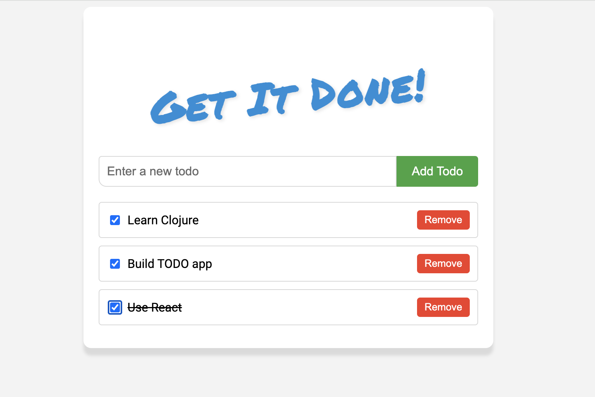

# Get It Done!

A very simple TODO app in Clojurescript.




### Instructions 

Modify `~/.clojure/deps.edn` to be able to use clj-new
```
{:aliases
 {:repl/conjure
  {:extra-deps {nrepl/nrepl       {:mvn/version "1.0.0"}
                cider/cider-nrepl {:mvn/version "0.42.1"}}
   :main-opts  ["--main" "nrepl.cmdline"
                "--middleware" "[cider.nrepl/cider-middleware]"
                "--interactive"]}
  :new {:extra-deps {seancorfield/clj-new {:mvn/version "1.3.415"}}
        :exec-fn clj-new/create
        :exec-args {}}}}
```

Now create a new project using clj-new and figwheel:

```
clj -X:new clj-new/create :template figwheel-main :name leytzher/todo :args '["--reagent"]'
```

To autocompile, get a browser REPL and hot-reloading
```
    clj -M:fig:build
```


To create a production build run:
```
	rm -rf target/public
	clj -A:fig:min
```
